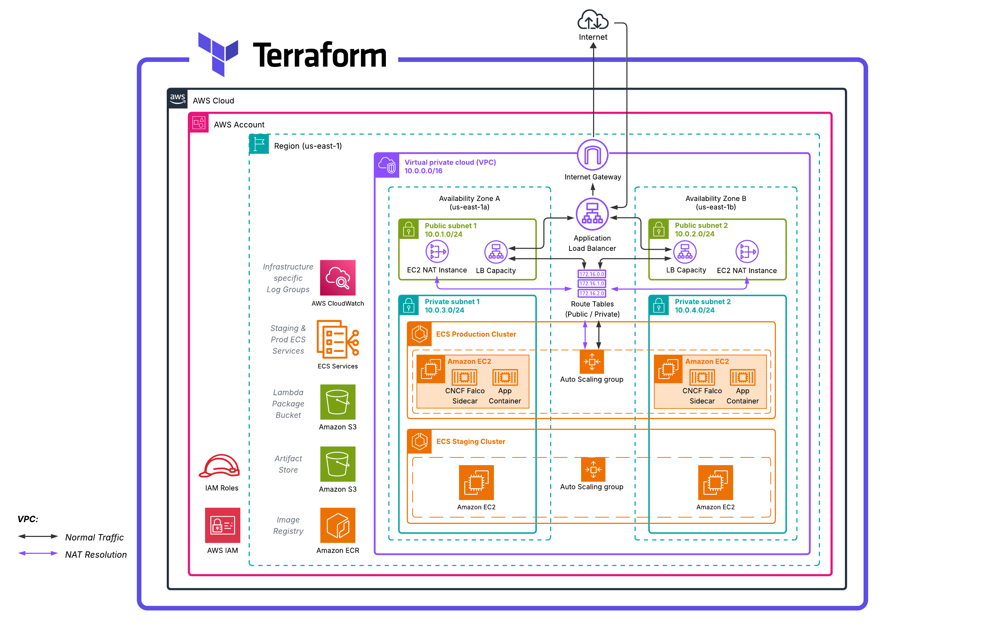
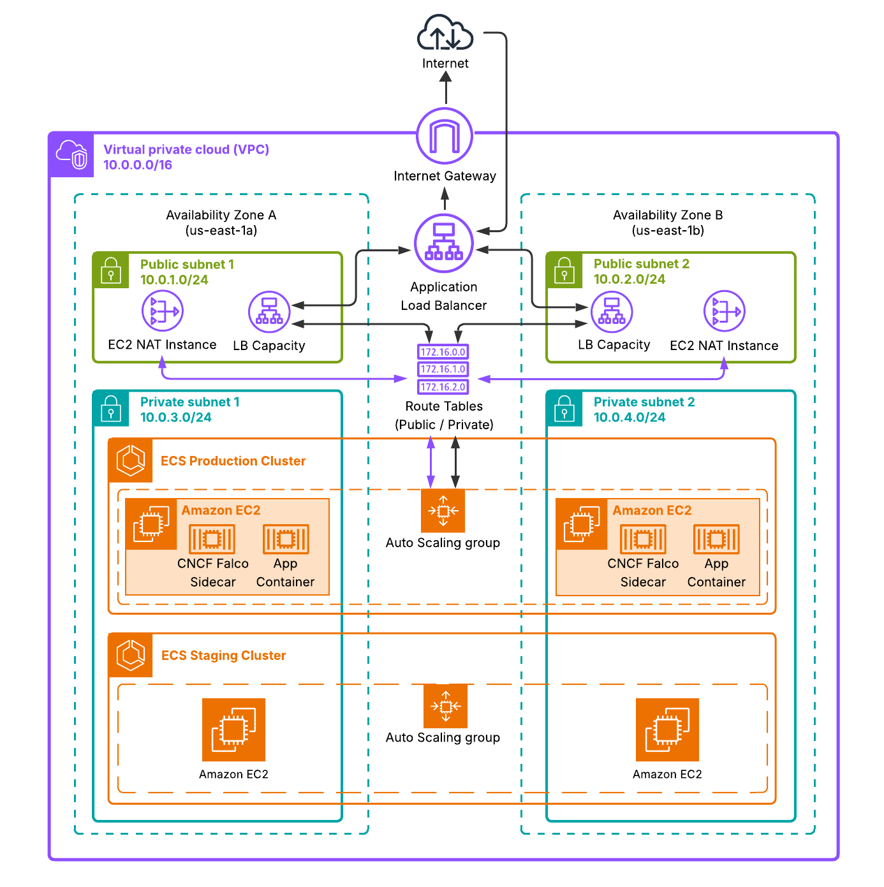
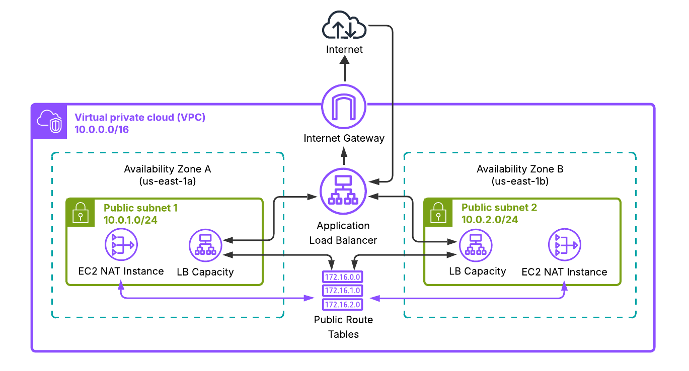
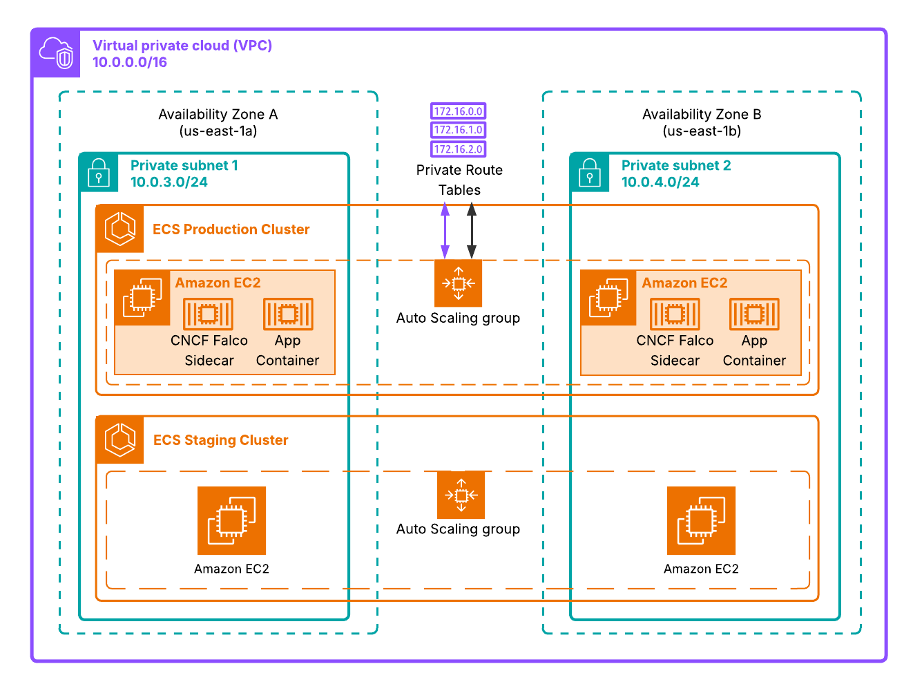
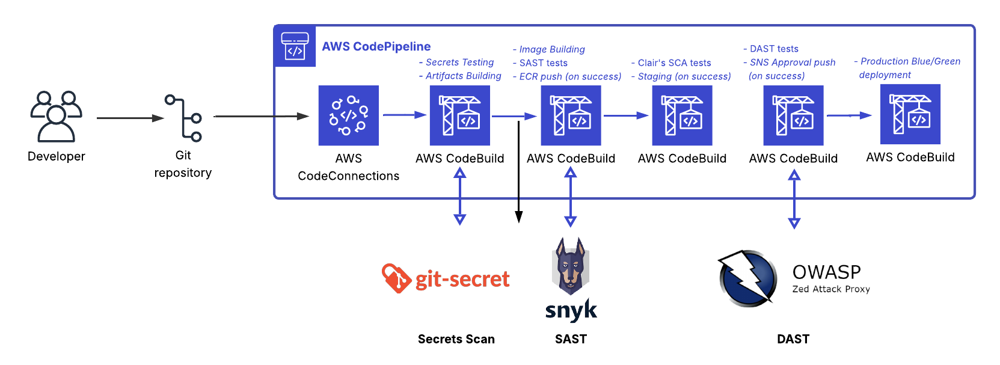
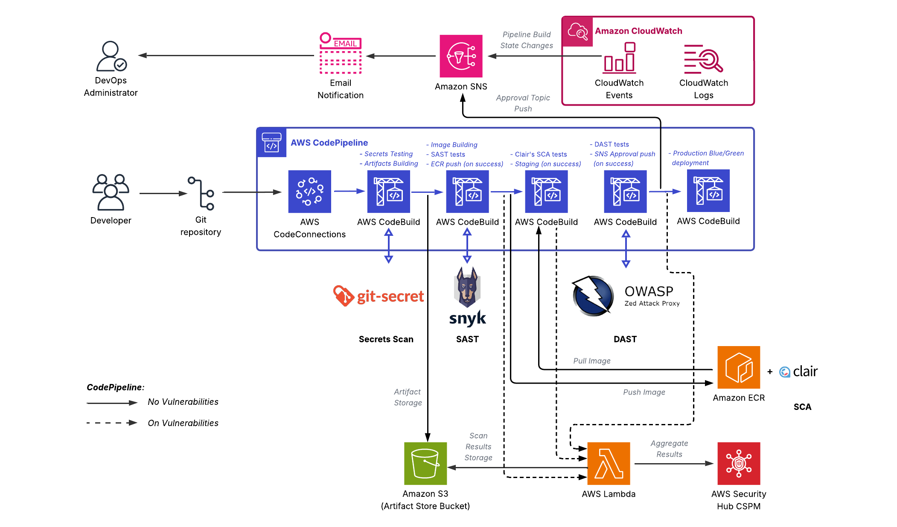
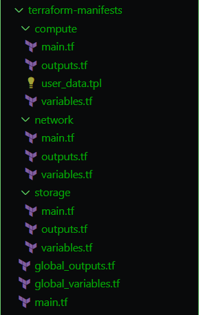

---
> **Last Updated:** October 25th, 2025
>
> **Author:** [Haitam Bidiouane](https://linkedin.com/in/haitam-bidiouane/)
---

# AWS DevSecOps Hybrid CI/CD Factory

This project implements a fully automated Hybrid DevSecOps Factory/Platform on AWS, designed to enforce security and compliance at every stage of the software delivery lifecycle, while decoupling <ins>**the CI/CD pipeline and related resources**</ins> from <ins>**the main platform**</ins> that hosts ECS EC2-based containerized application workloads, respectively via AWS CloudFormation and Terraform, hence the "Hybrid" label.

> [!NOTE]
> Architected, implemented, and fully documented by **Haitam Bidiouane** (***@sch0penheimer***).

## Table of Contents

### [Section I: Factory Architecture & Infrastructure Overview](#section-i-platform-architecture--infrastructure-overview)
- [Project Overview](#project-overview)
- [Architecture](#architecture)
  - [Hybrid IaC Approach](#hybrid-iac-approach)
  - [High-level AWS Architecture](#high-level-aws-architecture)

### [Section II: Architectural Deep Dive](#section-ii-architectural-deep-dive)
- [Terraform Infrastructure Sub-Architecture](#terraform-infrastructure-sub-architecture)
  - [VPC Architecture](#vpc-architecture)
  - [Public Resources Architecture](#public-resources-architecture)
  - [Private Resources Architecture](#private-resources-architecture)
- [AWS CloudFormation CI/CD Sub-Architecture](#cloudformation-ci/cd-sub-architecture)
  - [CodePipeline Architecture](#codepipeline-architecture)
  - [Pipeline Integration & Complete CI/CD Workflow](#pipeline-integration--complete-cicd-workflow)

### [Section III: Technical Implementation Details & Operations](#section-iii-technical-implementation-details--operations)
- [Modular Terraform Approach](#modular-terraform-appraoch)
  - [Global Variables & Outputs](#global-variables--outputs)
  - [Network Module](#networking-module)
    - [Subnetting Strategy & High Availability](#subnetting-strategy--high-availability)
    - [Custom NAT EC2 instances](#custom-nat-ec2-instances)
    - [ALB Load Balancers](#alb-load-balancers)
  - [Compute Module](#compute-module)
    - [ECS Staging & Production Clusters](#ecs-staging--production-clusters)
    - [Task Definitions](#task-definitions)
    - [Auto Scaling Groups](#auto-scaling-groups)
    - [ECR Repository](#ecr-repository)
  - [Storage Module](#storage-module)
    - [S3 Artifact Store](#s3-artifact-store)
    - [S3 Lambda Packaging Bucket](#s3-lambda-packaging-bucket)

- [AWS CloudFormation template](#aws-cloudformation-template)
  - [CI/CD Workflow](#cicd-workflow)
    - [AWS CodeConnections Connection](#aws-codeconnections-connection)
    - [Normalization & Aggregation Lambda Function](#security-normalizer-lambda-function)
    - [AWS CodeBuild Projects](#aws-codebuild-projects)
    - [Blue/Green Deployment Strategy](#blue--green-deployment-strategy)
  - [Security & Compliance](#security--compliance)
    - [SSM Parameter Store](#ssm-parameter-store)
    - [Encryption & KMS](#encryption--kms)
    - [Secrets Scanning (git-secrets)](#secrets-scanning)
    - [SAST - Static Application Security Analysis (Snyk)](#sast--static-application-security-analysis)
    - [SCA - Software Composition Analysis (Clair)](#sca--software-composition-analysis)
    - [DAST - Dynamic Application Security Analysis (OWASP ZAP)](#dast--dynamic-application-security-analysis)
    - [RASP - Runtime Application Security Protection (CNCF Falco)](#rasp--runtime-application-security-protection)
    - [AWS Security Hub Integration](#aws-security-hub-integration)
    - [IAM & Access Control](#iam--access-control)
  - [Event-Driven Architecture](#event-driven-architecture)
    - [AWS EventBridge Rules](#aws-eventbridge-rules)
    - [AWS CloudWatch Events](#aws-cloudwatch-events)
    - [SNS Topics & Subscriptions](#sns-topics--subscriptions)  
  - [Monitoring & Observability](#monitoring--observability)
    - [AWS CloudWatch Dedicated Log Groups](#aws-cloudwatch-dedicated-log-groups)
    - [AWS CloudTrail & AWS Config](#cloudtrail--config)

### [Section IV: Deployment & Configuration Guide](#section-iv-deployment--configuration-guide)
- [Deployment Scripts](#deployment-scripts)
- [Configuration Reference](#configuration-reference)
  - [Environment Variables](#environment-variables)
  - [Terraform Variables](#terraform-variables)
  - [CloudFormation Parameters](#cloudformation-parameters)
  - [Cross-IaC Integration](#cross-iac-integration)
- [License](#license)


<br/>

# Section I: Factory Architecture & Infrastructure Overview

## Project Overview

This AWS DevSecOps Hybrid CI/CD Factory represents a <ins>**DevSecOps Software Factory**</ins>, an evolved approach to software delivery that extends traditional DevOps practices by embedding security controls throughout the entire software development lifecycle. The factory concept provides a standardized, automated environment for building, testing, and deploying software with security as a first-class citizen rather than an afterthought.

- **Development**: Secure coding practices integrated from initial commit with automated pre-commit hooks and static analysis
- **Security**: Continuous security scanning through SAST, SCA, DAST, and RASP tools embedded in pipeline stages
- **Operations**: Infrastructure security hardening and runtime monitoring with automated incident response

---

The platform also introduces a novel <ins>**hybrid IaC approach**</ins> that strategically separates infrastructure concerns based on resource characteristics and lifecycle management requirements. This separation provides optimal tooling selection for different infrastructure layers.

Also, the platform is specifically architected for ***AWS Free Tier compatibility***, enabling immediate deployment without incurring charges for evaluation and small-scale production workloads.

---

## Architecture
### Hybrid IaC Approach

This platform implements a *strategic separation of Infrastructure as Code responsibilities* between <ins>**Terraform**</ins> and <ins>**AWS CloudFormation**</ins>, creating a hybrid model that leverages the strengths of each tool while maintaining clear boundaries of concern.

<div align="center">


*Figure 1: Hybrid Infrastructure as Code Architecture - Separation of concerns and integration between Terraform and AWS CloudFormation*

</div>

**I) Terraform Infrastructure Layer:**
Manages foundational, reusable infrastructure components and provisions core network and compute resources. This layer is optimized for long‑lived infrastructure that requires complex dependency handling and reliable state tracking

**II) CloudFormation Pipeline Layer:**
Manages orchestration of AWS-native services and pipeline-specific resources, this CloudFormation layer leverages native AWS integrations and built‑in drift detection to ensure reliable, maintainable pipeline lifecycle management.

### Cross-IaC Integration Pattern

1. **Terraform Deployment**: Deployment scripts execute `terraform plan` and `terraform apply` for infrastructure provisioning
2. **Output Capture**: Scripts capture Terraform outputs (VPC ID, subnet IDs, security group IDs) programmatically
3. **CloudFormation Orchestration**: Scripts initiate CloudFormation stack creation with captured Terraform outputs as parameter inputs
4. **Runtime Integration**: CloudFormation stack receives infrastructure identifiers and provisions pipeline resources with proper resource references

**Integration Architecture:**
```
          Deployment Script → Terraform Apply → Capture Outputs → CloudFormation Deploy
                  ↓                ↓                   ↓                   ↓
            Script Logic     Infrastructure    VPC ID, Subnets    Pipeline Resources
            Orchestration    Provisioning      Security Groups,    with References
                                                ECS Clusters, 
                                              Task definitions ...
```

- **Phase 1**: The provided Deployment Scripts execute Terraform deployment and wait for completion
- **Phase 2**: Scripts parse Terraform state or output files to extract resource identifiers
- **Phase 3**: Scripts construct CloudFormation parameter mappings from Terraform outputs
- **Phase 4**: Scripts deploy CloudFormation stack with parameter values for seamless integration

---
### High-level AWS Architecture

<div align="center">


*Figure 2: High-level AWS DevSecOps Factroy Architecture - Complete Software Factory Overview*

***(Click on the architecture for a better full-screen view)***

</div>

The AWS DevSecOps Hybrid CI/CD Factory implements a <ins>**multi-tier cloud-native architecture**</ins> that orchestrates secure software delivery through strategically decoupled infrastructure and pipeline layers. The platform leverages native AWS services to create a comprehensive DevSecOps environment with integrated security controls, automated compliance validation, and event-driven operational patterns.

**1. `Network Foundation Layer`:**
The platform implements a **Custom VPC Architecture** that isolates the network with thoughtfully segmented subnets across multiple Availability Zones to ensure high availability and fault tolerance, a **Custom NAT Strategy** that employs personalized EC2‑based NAT instances to provide controlled and <ins>FREE</ins> egress routing for resources in private subnets, and a **Load Balancing Infrastructure** using Application Load Balancers to efficiently distribute traffic across containerized application tiers.

**2. `Compute & Container Orchestration:`**
The platform uses distinct **ECS Cluster Architecture** by maintaining separate staging and production clusters running on EC2 instances managed by Auto Scaling Groups for dynamic capacity, and also leverages a secure **Container Registry** (Amazon ECR) for scalable image storage with built‑in vulnerability scanning, and implements a **Blue/Green Deployment** strategy to enable zero‑downtime releases by coordinating ECS service updates with ALB target‑group switching.

**3. `CI/CD Pipeline Infrastructure:`**
The factory relies on **AWS CodePipeline** as a multi‑stage orchestrator to integrate source control, coordinate builds, perform security scans, and automate deployments; **AWS CodeBuild** supplies isolated, containerized build environments for compiling code, executing security and compliance analyses, and producing artifacts; and centralized **S3 Artifact Management** handles artifact storage with versioning and lifecycle policies to manage pipeline dependencies.

**4. `Security Integration Layer:`**
**Multi-Stage Security Scanning** is implemented throughout the CI process: SAST, SCA, DAST, and RASP tools are embedded across pipeline stages to continuously detect code, dependency, runtime, and application-layer risks; **AWS Security Hub** centralizes findings while a custom Lambda function normalizes and correlates alerts for unified visibility and automated response;

**5. `Event-Driven Operations:`**
The platform uses **AWS EventBridge** for flexible event routing and automated incident‑response workflows, **CloudWatch Integration** for centralized monitoring, logging, and alerting across all components, and **SNS Topics** to distribute operational and security alerts across multiple channels.

**6. `Compliance & Governance:`**
**AWS Config** provides continuous configuration compliance checks and drift detection across resources, **CloudTrail Auditing** captures comprehensive API activity logs for security and compliance analysis, and **IAM Access Control** enforces least‑privilege access through role‑based permissions and explicit cross‑service trust relationships.

The architecture implements <ins>**separation of concerns**</ins> through distinct operational domains while maintaining seamless integration through AWS-native service communication patterns. Each architectural layer is designed for independent scaling, maintenance, and security policy enforcement.

<ins>**Detailed Technical Specifications:**</ins>

The next chapter provides comprehensive technical deep-dives into each architectural component, implementation details, and operational procedures. Each sub-architecture is documented with specific configuration parameters, security controls, and integration patterns

---

# Section II: Architectural Deep Dive
## Terraform Infrastructure Sub-Architecture
<div align="center">



*Figure 3: Terraform Infrastructure Sub-Architecture - Complete foundational infrastructure layer managed by Terraform*

***(Click on the architecture for a better full-screen view)***

</div>

The Terraform Infrastructure Sub-Architecture establishes the foundational layer of the DevSecOps Factory, managing long-lived infrastructure components through declarative configuration. This layer implements a <ins>**network-centric design**</ins> that provides secure, scalable infrastructure primitives for containerized workloads while maintaining strict separation between public and private resources.

**`Infrastructure State Management:`**
- **Terraform State Backend**: Remote state storage with locking mechanisms for concurrent execution prevention
- **Output Variables**: Structured data export for CloudFormation integration including VPC IDs, subnet identifiers, and security group references
- **Resource Tagging**: Comprehensive tagging strategy for cost allocation, environment identification, and compliance tracking

**| <ins>Network Foundation</ins>:**
- **Custom VPC**: Isolated network environment with `/16` CIDR block providing 65,531 (65,536 - 5 IPs reserved by AWS) available IP addresses across multiple Availability Zones
- **Subnet Segmentation**: Strategic separation between public subnets for internet-facing resources and private subnets for application workloads
- **Route Table Management**: Dedicated routing configurations for public internet access and private subnet egress through custom NAT instances

**| <ins>Compute Infrastructure</ins>:**
- **ECS Cluster Provisioning**: Separate staging and production clusters with EC2 launch configurations optimized for containerized workloads
- **Auto Scaling Groups**: Dynamic capacity management with configurable scaling policies based on CPU utilization and memory consumption
- **Security Group Configuration**: Network-level access control with least-privilege rules for inter-service communication

**| <ins>Load Balancing & Traffic Management</ins>:**
- **Application Load Balancer**: Layer 7 load balancing with SSL termination and target group management for blue/green deployments
- **Target Group Configuration**: Health check definitions and traffic routing rules for ECS service integration
- **Custom NAT Instance Strategy**: Cost-optimized egress solution using EC2 instances instead of managed NAT gateways

<br/>

Next, I will dive deeper into each section ***(VPC, Public & Private scopes)**


---
### VPC Architecture
<div align="center">



*Figure 4: VPC Network Architecture - Multi-AZ VPC design with strategic subnet segmentation and routing configuration*

***(Click on the architecture for a better full-screen view)***

</div>

The VPC Architecture implements a <ins>**multi-tier network design**</ins> that provides secure isolation, high availability, and controlled traffic flow for the DevSecOps Factory. The network foundation establishes clear boundaries between public-facing and private resources while enabling secure communication patterns across availability zones.

**`Network Topology & CIDR Design:`**
- **VPC CIDR Block**: `/16` network (`10.0.0.0/16`) providing 65,531 (65,536 - 5 IPs reserved by AWS) usable IP addresses for comprehensive resource allocation
- **Multi-AZ Distribution**: Resources distributed across `us-east-1a` and `us-east-1b` availability zones for fault tolerance and high availability
- **Subnet Allocation Strategy**: CIDR space partitioned to support both current deployment requirements and future scaling needs

**`Subnet Segmentation Strategy:`**
- **Public Subnets**: Internet-accessible subnets (`10.0.1.0/24`, `10.0.2.0/24`) hosting load balancers and NAT instances.
- **Private Subnets**: Isolated subnets (`10.0.3.0/24`, `10.0.4.0/24`) containing ECS clusters, application workloads, and sensitive resources
- **Reserved Address Space**: Additional CIDR ranges reserved for database subnets, cache layers, and future service expansion

**`Routing Architecture:`**
- **Internet Gateway**: Single IGW providing **EGRESS** internet connectivity for public subnet resources
- **Public Route Tables**: Direct routing to Internet Gateway for public subnet traffic with explicit 0.0.0.0/0 routes
- **Private Route Tables**: Custom routing through NAT instances for private subnet egress while maintaining inbound isolation
- **Local Route Propagation**: Automatic VPC-local routing for inter-subnet communication within the `10.0.0.0/16` space

**`Security & Access Control:`**
- **Security Groups**: Instance-level stateful firewalls rules are established to EVERYTHING enabling precise traffic control between application tiers and **LEAST PRIVILEGE ACCESS**

**`DNS & Name Resolution:`**
Only the Application Load Balancer (ALB) exposes a ***<ins>regional DNS name</ins>*** for *inbound internet access*. The ALB is the single public entry point; backend ECS/EC2 instances and other resources remain in private subnets without public IPs and receive traffic only from the ALB.

- The ALB publishes a regional DNS name (for example: my-alb-xxxxx.us-east-1.elb.amazonaws.com). **DO NOT RELY ON ALB IP ADDRESSES, as they are dynamic and subject to change**.
- Enforce security by allowing inbound HTTP/HTTPS only on the ALB security group; backend security groups accept traffic only from the ALB SG. Private resources use NAT instances for outbound internet access, not public-facing IPs.

This pattern centralizes inbound access control, simplifies TLS management, and keeps application workloads isolated behind the load balancer.

The VPC architecture establishes the network foundation that enables the **Public Resources Architecture** to provide internet-facing services and egress capabilities, while the **Private Resources Architecture** hosts secure application workloads with controlled network access patterns.

---
### Public Resources Architecture
<div align="center">



*Figure 5: Public Subnet Resources Architecture - Internet-facing components including ALB capacities and Custom NAT instances*

***(Click on the architecture for a better full-screen view)***

</div>

The Public Resources Architecture manages internet-facing infrastructure components within strategically segmented public subnets, providing controlled ingress and egress capabilities while maintaining cost optimization through custom NAT instance implementations. This layer serves as the <ins>**network perimeter**</ins> that bridges external internet connectivity with internal private resources.

- **Subnet `A` (us-east-1a)**: `10.0.1.0/24` providing 251 (256 - 5 IPs reserved by AWS) usable IP addresses for high-availability resource deployment
- **Subnet `B` (us-east-1b)**: `10.0.2.0/24` providing 251 (256 - 5 IPs reserved by AWS) usable IP addresses for cross-AZ redundancy and load distribution
- **Reserved IP Space**: Each `/24` subnet reserves sufficient addressing for future expansion including bastion hosts, additional NAT instances, and potential migration to AWS Managed NAT Gateways

- **Multi-AZ Deployment**: ALB automatically provisions network interfaces across both public subnets for high availability and traffic distribution
- **Cross-Zone Load Balancing**: Enabled by default to ensure even traffic distribution across availability zones regardless of target distribution
- **Internet Gateway Integration**: Direct routing from ALB to IGW for inbound HTTP/HTTPS traffic from internet clients
- **Security Group Configuration**: ALB security group permits inbound traffic on ports 80 and 443 from `0.0.0.0/0` while restricting all other protocols

**`Custom NAT Instance Strategy:`** **ECS_CONTROL_PLANE_DNS_NAME** : The sole operational reason NAT instances are needed is to allow ECS agent and EC2-backed container instances in private subnets to reach the **regional ECS control plane**. You can avoid public internet egress by using <ins>VPC endpoints</ins>, but those endpoints typically incur additional charges and are not covered by the AWS Free Tier. For Free Tier–compatible, low-cost evaluations I therefore managed to setup outbound Internet access via **my own lightweight custom NAT EC2 instances** (one per AZ) instead of paid VPC endpoint alternatives.
- **Cost Optimization**: Deployed in each public subnet as `t2.micro` instances to maintain **AWS Free Tier eligibility** instead of using AWS Managed NAT Gateways (`$45/month` per gateway)
- **High Availability**: One NAT instance per availability zone providing redundant egress paths for private subnet resources
- **Instance Configuration**: Amazon Linux 2 AMI with custom User Data script handling IP forwarding, iptables rules, and source/destination check disabling

**`Network Routing & Traffic Flow:`**
- **Ingress Path**: Internet → IGW → ALB (Public Subnets) → Target Groups (Private Subnets)
- **Egress Path**: Private Resources → NAT Instances (Public Subnets) → IGW → Internet
- **Route Table Association**: Public subnets use route tables with `0.0.0.0/0` pointing to Internet Gateway for direct internet connectivity

**`Security & Access Control:`**
- **NAT Instance Security Groups**: Restrictive ingress rules allowing only traffic from private subnet CIDR ranges while permitting outbound internet access
- **Source/Destination Check**: Disabled on NAT instances to enable packet forwarding between private subnets and internet

The custom NAT instance implementation leverages a **User Data script** available in the codebase that configures the EC2 instances for NAT functionality, including network interface configuration, routing table setup, and traffic forwarding rules. Detailed technical implementation of these NAT instances will be covered in the Technical Implementation section.

### Private Resources Architecture
<div align="center">



*Figure 6: Private Subnet Resources Architecture - Internal ECS clusters and Associated ASGs (Auto-Scaling Groups)*

***(Click on the architecture for a better full-screen view)***

</div>

The Private Resources Architecture hosts the core application workloads within isolated private subnets, providing secure compute environments for containerized applications while maintaining strict network isolation from internet access. This layer implements <ins>**defense-in-depth security**</ins> through subnet isolation, security group controls, and NAT-based egress routing.

**`Private Subnet Distribution & CIDR Allocation:`**
- **Subnet `C` (us-east-1a)**: `10.0.3.0/24` providing 251 usable IP addresses for staging environment ECS cluster and associated resources
- **Subnet `D` (us-east-1b)**: `10.0.4.0/24` providing 251 usable IP addresses for production environment ECS cluster and cross-AZ redundancy
- **Reserved IP Space**: Each `/24` subnet reserves addressing capacity for database subnets, cache layers, and additional compute resources

**`ECS Clusters Architecture:`** 
This implementation uses ECS with EC2-backed container instances (not AWS Fargate). Choosing ECS EC2-based workloads provides an in‑depth infrastructural vision and full host-level control (AMIs, kernel tuning, custom NAT, networking, IAM roles, and node-level observability) needed for security hardening and operational transparency. It also reduces costs and preserves **AWS Free Tier eligibility** (t2.micro instances for low‑capacity ASGs and NAT) versus Fargate’s per-task pricing, which helps keep the factory affordable for evaluation and small-scale deployments.
### ECS Clusters & Auto Scaling

- **Staging Cluster**: Private subnet (us-east-1a). ASG: min `0`, desired `0`, max `2` (t2.micro for cost/Free Tier), as these staging instances are meant to be **EPHEMERAL**, and called only by the associated DAST stage and die afterwards.
- **Production Cluster**: Cross-AZ private subnets. ASG: min `1`, desired `1`, max `2` (t2.micro by default).
- **EC2 Launch Templates**: <ins>ECS-Optimized AMI</ins>, IAM instance profile, user-data, security groups, and CloudWatch/log agents for consistent hosts.
- **Scaling & Resilience**: Use target-tracking (CPU/memory) or step policies; enable ECS draining + ASG lifecycle hooks and health checks for graceful replacement.
- **Deployment Strategy**: Rolling updates (ASG + ECS) to maintain availability during instance replacements.
- **Operational Note**: Tune instance types and ASG bounds per workload; keep t2.micro for evaluation/Free Tier compatibility.

**`Database Layer Considerations:`**
For this implementation, **no database layer is deployed** to maintain simplicity as the factory will be tested with a lightweiht yet kind of vulnerable FastAPI application that uses mock JSON data. However, the architecture can support easy database integration through the following pattern:
- **Database Subnets**: Additional private subnets (`10.0.5.0/24`, `10.0.6.0/24`) reserved for RDS deployment across availability zones
- **Security Group Configuration**: Database security groups configured to accept connections only from ECS cluster security groups on database-specific ports
- **Read Replica Strategy**: Cross-AZ read replicas in the second availability zone for high availability and read scaling
- **Backup & Recovery**: Automated backup strategies with point-in-time recovery capabilities integrated with the existing monitoring infrastructure (+++ $$$)

The private subnet architecture ensures application workloads remain completely isolated from direct internet access while maintaining necessary connectivity for container orchestration, monitoring, and automated deployment processes through the CI/CD pipeline.

## AWS CloudFormation CI/CD Sub-Architecture
<div align="center">


*Figure 7: CloudFormation CI/CD Sub-Architecture - Complete pipeline infrastructure and AWS-native service orchestration*

***(Click on the architecture for a better full-screen view)***

</div>

The AWS CloudFormation CI/CD Sub-Architecture manages the pipeline orchestration layer of the DevSecOps Factory, handling AWS-native service integration and automated software delivery workflows. This layer implements <ins>**pipeline-as-code patterns**</ins> that provide secure, scalable CI/CD capabilities while maintaining seamless integration with the Terraform-managed infrastructure foundation.

**`Pipeline State Management:`**
- **CloudFormation Stack Management**: Declarative stack definitions with built-in drift detection and rollback capabilities for pipeline resource lifecycle
- **Parameter Integration**: Dynamic parameter injection from Terraform outputs enabling cross-IaC resource referencing and configuration
- **Resource Tagging**: Consistent tagging strategy for pipeline resources aligned with infrastructure layer for unified cost tracking and governance

**| <ins>Source Control Integration</ins>:**
- **AWS CodeConnections (ex-AWS CodeStar Connections)**: Secure remote git repo provider (GitLab, GitHub, Bitbucket, ...) integration providing webhook-based source code monitoring and automated pipeline triggering
- **Branch Strategy**: Multi-branch support enabling feature branch deployments and environment-specific pipeline execution
- **Source Artifact Management**: Automated source code packaging and versioning for downstream pipeline stage consumption

**| <ins>Build & Security Pipeline</ins>:**
- **AWS CodeBuild Projects**: Containerized build environments executing multi-stage security scanning including SAST, SCA, DAST, and compliance validation
- **Security by Design**: Embedded security tools (Snyk, OWASP ZAP, git-secrets, Clair) providing comprehensive vulnerability assessment across the software supply chain
- **Artifact Generation**: Container image building, security scanning, and artifact packaging for deployment to target environments
- **Secrets Management**: All sensitive values (secrets, API keys, endpoint URLs, tokens, etc.) are stored as SecureString parameters in <ins>AWS SSM Parameter Store</ins>. Pipeline and CodeBuild jobs access them via least‑privilege IAM roles and explicit parameter ARNs; no credentials are hardcoded in source or buildspecs.


**| <ins>Deployment Orchestration</ins>:**
- **Multi-Environment Deployment**: Automated <ins>staging</ins> & <ins>production</ins> deployment workflows with environment-specific configuration management
- **Blue/Green Strategy**: Zero-downtime deployment implementation through ECS service coordination and ALB target group management
- **Approval Gate**: Manual approval controls for production deployments ensuring human oversight for critical environment changes

**| <ins>Monitoring & Notifications</ins>:**
- **AWS EventBridge Integration**: Event-driven pipeline monitoring and automated incident response workflows
- **AWS CloudWatch Integration**: Comprehensive pipeline metrics, logging, and alerting across all stages and environments
- **AWS SNS Multi-topic Notifications**: Multi-topic notification distribution for pipeline status, security findings, and operational alerts

<br/>

Next, I will dive deeper into each section (***<ins>AWS CodePipeline Architecture</ins>*** & ***<ins>Pipeline Integration Workflow</ins>***)

### CodePipeline Architecture
<div align="center">



*Figure 8: CodePipeline Architecture - Multi-stage pipeline with integrated security scanning and deployment automation*

***(Click on the architecture for a better full-screen view)***

</div>

The CodePipeline Architecture implements a <ins>**multi-stage security-first automated delivery pipeline**</ins> that orchestrates the complete software delivery lifecycle from source code commit to production deployment. This pipeline integrates comprehensive security scanning, quality assurance, and deployment automation while maintaining strict separation between staging and production environments.

**`Pipeline Stage Configuration:`**
- **Source Stage**: AWS CodeConnections integration for automated source code retrieval from GitHub repository with webhook-triggered pipeline execution
- **Build Stage**: Five parallel CodeBuild projects executing comprehensive security scanning and artifact generation
- **Deploy-Staging Stage**: Automated deployment to ephemeral staging environment ECS cluster for integration testing and DAST validation
- **Approval Stage**: Manual approval gate requiring human authorization before production deployment for critical environment protection
- **Deploy-Production Stage**: Blue/green deployment to production ECS cluster with zero-downtime service updates and traffic switching

**`AWS CodeBuild Project Architecture:`**
- **Secrets-Scanning Project**: Dedicated build environment executing git-secrets for credential leak detection and sensitive data exposure prevention, with code artifact generation and S3 archiving
- **SAST-Snyk Project**: Static Application Security Testing environment using Snyk for code vulnerability analysis combined with Docker image building and ECR repository pushing
- **SCA-Clair Project**: Software Composition Analysis using Clair for dependency vulnerability and image scanning assessment with automated staging environment deployment coordination
- **DAST-OWASP-ZAP Project**: Dynamic Application Security Testing environment executing OWASP ZAP penetration testing against live staging application endpoints with automated approval triggering on successful validation
- **Production-BlueGreen Project**: Blue/green deployment orchestration managing ECS service updates, ALB target group switching, and zero-downtime production releases

Each CodeBuild execution provisions ephemeral, fresh, isolated container environments, ensuring a clean build state and preventing artifact contamination between pipeline runs.

I will tackle in the next section the whole CI/CD workflow and the pipeline’s integration with all the related services in the CI/CD process.

### Pipeline Integration & Complete CI/CD Workflow
<div align="center">



*Figure 9: Pipeline Integration & CI/CD Workflow - End-to-end CI/CD workflow with security gates, artifact management & multi-environment deployment orchestration*

***(Click on the architecture for a better full-screen view)***

</div>

The full CI/CD Workflow implements a <ins>**comprehensive end-to-end DevSecOps automation**</ins> that orchestrates secure software delivery through integrated security scanning, artifact management, centralized monitoring, and automated notification systems. This workflow ensures security compliance at every stage while maintaining operational transparency and incident response capabilities.

**`End-to-End Sequential Workflow:`**

***<ins>Phase 1: Source Code Trigger & Artifact Preparation</ins>***

1. Developer commits code to the remote repository triggering AWS CodeConnections webhook
2. CodePipeline automatically initiated with source artifact packaging and S3 storage
3. Pipeline execution metadata (commit SHA, timestamp, branch) captured for traceability

***<ins>Phase 2: SAST Scanning & Build Process</ins>***

4. Secrets-Scanning Project executes git-secrets analysis for credential exposure detection with immediate pipeline termination on any secret detection
5. SAST-Snyk Project performs static code analysis and vulnerability assessment:
   - **Low/Medium Vulnerabilities**: Docker container image built and pushed to ECR repository
   - **High/Critical Vulnerabilities**: Docker container image NOT built NOR pushed to ECR repository  
   - **Lambda Function Triggered**: Security findings from Snyk analysis sent to Lambda Normalization Function regardless of severity level
6. Lambda Normalization Function triggered by Snyk security scan completion. It  archives results to S3 artifact store with standardized scale & naming conventions, transformes findings to AWS Security Hub ASFF format with severity classification, and publishes normalized findings to AWS Security Hub for centralized visibility
7. Pipeline continues to next stage regardless of Snyk findings severity

***<ins>Phase 4: Container Image Security Analysis & Staging Decision</ins>***

8. SCA-Clair Project pulls container image from ECR and performs comprehensive dependency vulnerability scanning
    - **Low/Medium Vulnerabilities**: Staging environment deployment initiated
    - **High/Critical Vulnerabilities**: Pipeline stage fails and terminates
    - **Lambda Function Triggered**: Clair security findings sent to Lambda Normalization Function regardless of outcome
9. Lambda Normalization Function processes Clair findings and publishes to Security Hub (same process as Snyk stage)
10. If Clair vulnerabilities are Low/Medium: ECS staging cluster Auto Scaling Group scales from 0 to 1 instance
11. ECS task definition updated with validated container image from ECR repository
12. Staging application deployed and health checks validated before DAST execution

***<ins>Phase 5: DAST Pentesting</ins>***

13. DAST-OWASP-ZAP Project executes comprehensive **pentesting** against live staging endpoints:
    - **Low/Medium Vulnerabilities**: Manual approval gate triggered via SNS topic notification
    - **High/Critical Vulnerabilities**: Pipeline stage fails and terminates
    - **Lambda Function Triggered**: OWASP ZAP findings sent to Lambda Normalization Function regardless of outcome
14. Lambda Normalization Function processes DAST results and publishes to Security Hub (same process as Snyk or Clair stages)
15. Staging ECS cluster automatically scales down to 0 instances

***<ins>Phase 6: Security Gate Validation & Manual Approval (Conditional)</ins>***

16. Security team reviews consolidated security findings in Security Hub dashboard if SNS manual approval notification is sent by the previous stage
17. Manual approval gate activated requiring human authorization for production deployment

***<ins>Phase 7: Production Blue/Green Deployment (Approval Required)</ins>***

18. Upon Manual Approval, Production-BlueGreen Project execution triggered
19. New ECS task definition created with security-validated container image (Blue environment)
20. Blue environment health checks validated before traffic switching
21. ALB target group gradually switched from Green to Blue environment
22. Zero-downtime deployment completed with old Green environment termination

***<ins>Phase 8: Post-Deployment Monitoring & Cleanup</ins>***

23. CloudWatch metrics and EventBridge events monitor deployment success

***<ins>Phase 9: Continuous Monitoring & Feedback Loop</ins>***

24. RASP tool (CNCF Falco) provides continuous runtime security monitoring for production workloads, especially the **<ins>Docker container runtime</ins>**
25. Security Hub maintains historical tracking of all vulnerability findings across pipeline executions and RASP.


This sequential workflow ensures comprehensive security validation at every stage while maintaining operational efficiency and cost optimization through ephemeral staging environments and automated cleanup processes.

The Factory's CI/CD Workflow creates a comprehensive DevSecOps automation that ensures enterprise-grade software delivery.

---

# Section III: Technical Implementation Details & Operations

## Modular Terraform Approach

<div align="center">



*Figure 10: Terraform Modular Folder Structure - Organized module-based infrastructure provisioning*

</div>

The Terraform implementation follows a <ins>**modular architecture pattern**</ins> that promotes code reusability, maintainability, and separation of concerns across different infrastructure domains. This approach enables independent module development, testing, and deployment while maintaining consistent resource provisioning and configuration management.

The Terraform codebase containes a **root module** that orchestrates composition and cross‑module data flow among **3 specialized modules** : <ins>***`Network`***</ins>, <ins>***`Compute`***</ins> and <ins>***`Storage`***</ins>, with each module exposing structured outputs consumed by others via explicit variable passing and output‑to‑input mappings, since each module declares its own **VARIABLES**, **MAIN**, and **OUTPUTS** files.

The modular approach enables independent infrastructure layer management while maintaining integration points necessary for the hybrid IaC strategy with CloudFormation pipeline resources.

### Global Variables & Outputs
The root Terraform configuration establishes <ins>**centralized variable management**</ins> and <ins>global output coordination</ins> across all modules, providing consistent configuration and enabling seamless cross-module data flow. The root level manages global settings, module orchestration, and structured output generation for CloudFormation integration.

**`Root Configuration File`**:

The main configuration file orchestrates module composition and establishes provider configurations:

```hcl
module "network" {
  source = "./modules/network"
  
  aws_region             = var.aws_region
  environment           = var.environment
  project_name          = var.project_name
  vpc_cidr_block        = var.vpc_cidr_block
  availability_zones    = var.availability_zones
}

module "compute" {
  source = "./modules/compute"
  
  environment           = var.environment
  project_name          = var.project_name
  vpc_id               = module.network.vpc_id
  private_subnet_ids   = module.network.private_subnet_ids
  public_subnet_ids    = module.network.public_subnet_ids
  alb_security_group_id = module.network.alb_security_group_id
}

module "storage" {
  source = "./modules/storage"
  
  environment    = var.environment
  project_name   = var.project_name
  aws_region     = var.aws_region
}
```
> **Check File**

> [terraform-manifests/main.tf](./terraform-manifests/main.tf)

<br/>

**`Global Variable Definitions`**:

Centralized variable management ensures consistent configuration across all modules:

```hcl
variable "aws_region" {

}

variable "environment" {
}

...
```
> **Check File**

> [terraform-manifests/global_variables.tf](./terraform-manifests/global_variables.tf)

<br/>


**`Structured Output Generation:`**

Root outputs aggregate module outputs for CloudFormation parameter injection:

```hcl
#- Networking Outputs -#
output "vpc_id" {
  description = "VPC identifier for CloudFormation integration"
  value       = module.network.vpc_id
}

output "private_subnet_ids" {
  description = "Private subnet identifiers for ECS cluster deployment"
  value       = module.network.private_subnet_ids
}

output "alb_dns_name" {
  description = "Application Load Balancer DNS name for application access"
  value       = module.network.alb_dns_name
}

#- Compute Infrastructure Outputs -#
output "ecs_cluster_staging_name" {
  description = "ECS staging cluster name for pipeline deployment"
  value       = module.compute.ecs_cluster_staging_name
}

output "ecs_cluster_production_name" {
  description = "ECS production cluster name for pipeline deployment"
  value       = module.compute.ecs_cluster_production_name
}

output "ecr_repository_uri" {
  description = "ECR repository URI for container image storage"
  value       = module.compute.ecr_repository_uri
}

...

```

> **Check File**

> [terraform-manifests/global_outputs.tf](./terraform-manifests/global_outputs.tf)

<br/>


The root config module establishes dependency relationships and data flow between modules through explicit output-to-input variable mapping, ensuring proper resource provisioning order and configuration consistency across the entire infrastructure stack.

### Network Module
#### Subnetting Strategy & High Availability
#### Custom NAT EC2 instances
#### ALB Load Balancers

### Compute Module
#### ECS Staging & Production Clusters
#### Task Definitions
#### Auto Scaling Groups
#### ECR Repository

### Storage Module
#### S3 Artifact Store
#### S3 Lambda Packaging Bucket

## AWS CloudFormation template
### CI/CD Workflow
#### AWS CodeConnections Connection
#### Normalization & Aggregation Lambda Function
#### AWS CodeBuild Projects
#### Blue/Green Deployment Strategy

### Security & Compliance
#### SSM Parameter Store
#### Encryption & KMS
#### Secrets Scanning (git-secrets)
#### SAST - Static Application Security Analysis (Snyk)
#### SCA - Software Composition Analysis (Clair)
#### DAST - Dynamic Application Security Analysis (OWASP ZAP)
#### RASP - Runtime Application Security Protection (CNCF Falco)
#### AWS Security Hub Integration
#### IAM & Access Control

### Event-Driven Architecture
#### AWS EventBridge Rules
#### AWS CloudWatch Events
#### SNS Topics & Subscriptions

### Monitoring & Observability
#### AWS CloudWatch Dedicated Log Groups
#### AWS CloudTrail & AWS Config