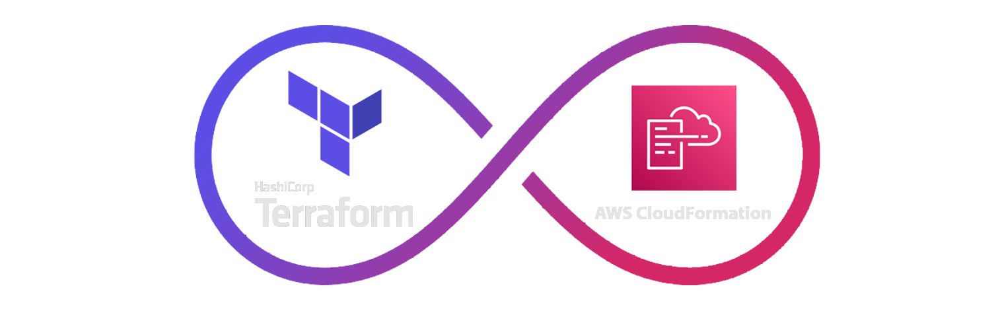
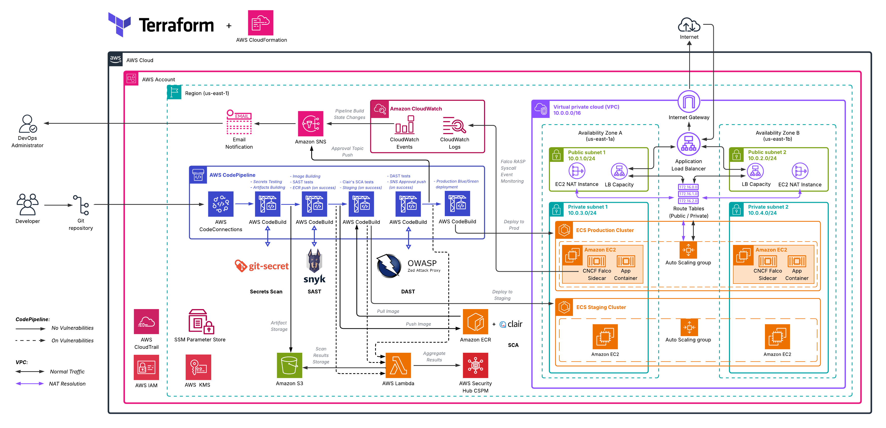

---
> **Last Updated:** October 10th, 2025  
> **Author:** [Haitam Bidiouane](https://github.com/sch0penheimer)
---

# AWS DevSecOps Hybrid CI/CD Factory

This project implements a fully automated Hybrid DevSecOps Factory/Platform on AWS, designed to enforce security and compliance at every stage of the software delivery lifecycle, while decoupling <ins>**the CI/CD pipeline and related resources**</ins> from <ins>**the main platform**</ins> that hosts ECS EC2-based containerized application workloads, respectively via AWS CloudFormation and Terraform, hence the "Hybrid" label.

> [!NOTE]
> Architected, implemented, and fully documented by **Haitam Bidiouane** (***@sch0penheimer***).

## Table of Contents

### [Section I: Factory Architecture & Infrastructure Overview](#section-i-platform-architecture--infrastructure-overview)
- [Project Overview](#project-overview)
- [Architecture](#architecture)
  - [Hybrid IaC Approach](#hybrid-iac-approach)
  - [High-level AWS Architecture](#high-level-aws-architecture)

### [Section II: Architectural Deep Dive](#section-ii-architectural-deep-dive)
- [Terraform Infrastructure Sub-Architecture](#terraform-infrastructure-sub-architecture)
  - [VPC Architecture](#vpc-architecture)
  - [Public Resources Architecture](#public-resources-architecture)
  - [Private Resources Architecture](#private-resources-architecture)
- [AWS CloudFormation CI/CD Sub-Architecture](#cloudformation-ci/cd-sub-architecture)
  - [CodePipeline Architecture](#codepipeline-architecture)
  - [Pipeline Integration & Workflow](#pipeline-integration--workflow)

### [Section III: Technical Implementation Details & Operations](#section-iii-technical-implementation-details--operations)
- [VPC Internal Networking](#vpc-internal-networking)
  - [Subnetting Strategy & High Availability](#subnetting-strategy--high-availability)
  - [Custom NAT EC2 instances](#custom-nat-ec2-instances)
  - [ALB Load Balancers](#alb-load-balancers)
- [ECS Infrastructure Details](#ecs-infrastructure-details)
  - [Staging & Production Clusters](#staging--production-clusters)
  - [Task Definitions](#task-definitions)
  - [Auto Scaling Groups](#auto-scaling-groups)
  - [ECR Repository](#ecr-repository)
- [CI/CD Pipeline](#cicd-pipeline)
  - [AWS CodePipeline Stages](#codepipeline-stages)
    - [AWS CodeConnections Connection](#aws-codeconnections-connection)
    - [AWS CodeBuild Projects](#aws-codebuild-projects)
  - [S3 Artifact Store](#s3-artifact-store)
  - [Normalization & Aggregation Lambda Function](#security-normalizer-lambda-function)
  - [Blue/Green Deployment Strategy](#blue--green-deployment-strategy)
- [Security & Compliance](#security--compliance)
  - [Security Tools Integration](#security-tools-integration)
    - [Secrets Scanning (git-secrets)](#secrets-scanning)
    - [SAST - Static Application Security Analysis (Snyk)](#sast--static-application-security-analysis)
    - [SCA - Software Composition Analysis](#sca--software-composition-analysis)
    - [DAST - Dynamic Application Security Analysis (OWASP ZAP)](#dast--dynamic-application-security-analysis)
    - [RASP - Runtime Application Security Protection (CNCF Falco)](#rasp--runtime-application-security-protection)
  - [AWS Security Hub Integration](#aws-security-hub-integration)
  - [IAM & Access Control](#iam--access-control)
  - [SSM Parameter Store](#ssm-parameter-store)
  - [Encryption & KMS](#encryption--kms)
- [Event-Driven Architecture](#event-driven-architecture)
  - [AWS EventBridge Rules](#aws-eventbridge-rules)
  - [AWS CloudWatch Events](#aws-cloudwatch-events)
  - [SNS Topics & Subscriptions](#sns-topics--subscriptions)  
- [Monitoring & Observability](#monitoring--observability)
  - [AWS CloudWatch Dedicated Log Groups](#aws-cloudwatch-dedicated-log-groups)
  - [AWS CloudTrail & AWS Config](#cloudtrail--config)

### [Section IV: Deployment & Configuration Guide](#section-iv-deployment--configuration-guide)
- [Deployment Scripts](#deployment-scripts)
- [Configuration Reference](#configuration-reference)
  - [Environment Variables](#environment-variables)
  - [Terraform Variables](#terraform-variables)
  - [CloudFormation Parameters](#cloudformation-parameters)
  - [Cross-IaC Integration](#cross-iac-integration)
- [License](#license)


<br/>

# Section I: Factory Architecture & Infrastructure Overview

## Project Overview

This AWS DevSecOps Hybrid CI/CD Factory represents a <ins>**DevSecOps Software Factory**</ins>, an evolved approach to software delivery that extends traditional DevOps practices by embedding security controls throughout the entire software development lifecycle. The factory concept provides a standardized, automated environment for building, testing, and deploying software with security as a first-class citizen rather than an afterthought.

- **Development**: Secure coding practices integrated from initial commit with automated pre-commit hooks and static analysis
- **Security**: Continuous security scanning through SAST, SCA, DAST, and RASP tools embedded in pipeline stages
- **Operations**: Infrastructure security hardening and runtime monitoring with automated incident response

---

The platform also introduces a novel <ins>**hybrid IaC approach**</ins> that strategically separates infrastructure concerns based on resource characteristics and lifecycle management requirements. This separation provides optimal tooling selection for different infrastructure layers.

Also, the platform is specifically architected for ***AWS Free Tier compatibility***, enabling immediate deployment without incurring charges for evaluation and small-scale production workloads.

---

## Architecture
### Hybrid IaC Approach

This platform implements a *strategic separation of Infrastructure as Code responsibilities* between <ins>**Terraform**</ins> and <ins>**AWS CloudFormation**</ins>, creating a hybrid model that leverages the strengths of each tool while maintaining clear boundaries of concern.

<div align="center">



*Figure 1: Hybrid Infrastructure as Code Architecture - Separation of concerns and integration between Terraform and AWS CloudFormation*

</div>

**I) Terraform Infrastructure Layer:**
Manages foundational, reusable infrastructure components and provisions core network and compute resources. This layer is optimized for long‑lived infrastructure that requires complex dependency handling and reliable state tracking

**II) CloudFormation Pipeline Layer:**
Manages orchestration of AWS-native services and pipeline-specific resources, this CloudFormation layer leverages native AWS integrations and built‑in drift detection to ensure reliable, maintainable pipeline lifecycle management.

### Cross-IaC Integration Pattern

1. **Terraform Deployment**: Deployment scripts execute `terraform plan` and `terraform apply` for infrastructure provisioning
2. **Output Capture**: Scripts capture Terraform outputs (VPC ID, subnet IDs, security group IDs) programmatically
3. **CloudFormation Orchestration**: Scripts initiate CloudFormation stack creation with captured Terraform outputs as parameter inputs
4. **Runtime Integration**: CloudFormation stack receives infrastructure identifiers and provisions pipeline resources with proper resource references

**Integration Architecture:**
```
          Deployment Script → Terraform Apply → Capture Outputs → CloudFormation Deploy
                  ↓                ↓                   ↓                   ↓
            Script Logic     Infrastructure    VPC ID, Subnets    Pipeline Resources
            Orchestration    Provisioning      Security Groups,    with References
                                                ECS Clusters, 
                                              Task definitions ...
```

- **Phase 1**: The provided Deployment Scripts execute Terraform deployment and wait for completion
- **Phase 2**: Scripts parse Terraform state or output files to extract resource identifiers
- **Phase 3**: Scripts construct CloudFormation parameter mappings from Terraform outputs
- **Phase 4**: Scripts deploy CloudFormation stack with parameter values for seamless integration

---
### High-level AWS Architecture

<div align="center">



*Figure 2: High-level AWS DevSecOps Platform Architecture - Complete Software Factory Overview*

***(Click on the architecture for a better full-screen view)***

</div>

---

